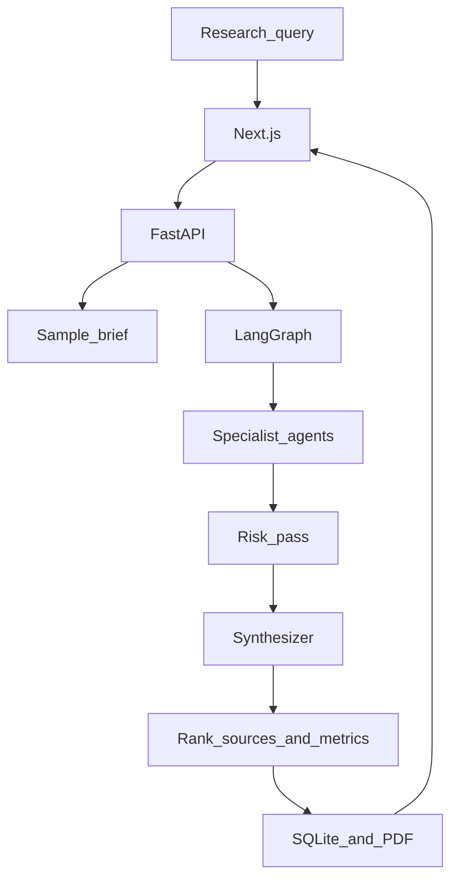

# Enterprise AI Research Agent

Transformation research system for enterprise AI decisions.

Submit a question. Specialist agents gather company context, industry signals, news, competitor moves, and opportunity areas. A risk pass runs next. The synthesizer returns a brief with recommendation rationales, linked claims, and sources.

## Quick start

```bash
# backend
cd P27_MODUS
source .venv/bin/activate
pip install -r requirements.txt
./run_api.sh

# frontend (new terminal)
cd frontend
npm install
npm run dev
```

Open http://localhost:3000

Click **Load sample brief** for an instant polished demo, or run a live research job.

## What reviewers should notice

- Instant sample brief for mid-size retail bank operations
- 1-page brief vs full report
- Confidence score and quality metrics at the top
- Claim → source linking
- Named competitors only
- Role filters: COO / Risk / Transformation
- Agent timeline and contribution summary
- Optional document upload and what-if scenario
- Viewer identity + brief history
- Board-style PDF export
- Product roadmap inside the app

## Architecture

```text
Next.js UI
  → FastAPI (jobs, SSE, uploads, demo, PDF)
     → LangGraph
        Planner
          → Company | Industry | News
          → Competitors | Opportunities
          → Risk / Governance
          → Synthesizer + enrichment
     → SQLite jobs/history
     → Redis optional cache
     → PDF export
```



## Deploy outline

- Frontend: Vercel / Netlify pointing `NEXT_PUBLIC_API_URL` at the API
- API: Railway / Render / Fly with the same `.env` secrets
- Optional Redis addon for cache

This repository is ready to deploy; secrets stay in environment variables, never in git.

## Example queries

- AI transformation opportunities for a mid-size retail bank in operations
- Enterprise AI opportunities in order-to-cash for a CPG company
- How should a hospital system approach AI automation in clinical admin?
